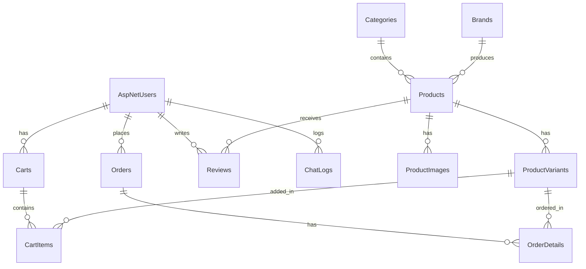

# TrendVibe - Website Thương Mại Điện Tử Bán Quần Áo (Decoupled FE & BE)

Dự án Website thương mại điện tử bán quần áo thời trang cao cấp hoàn chỉnh, sẵn sàng triển khai (Production-ready). Dự án được thiết kế theo kiến trúc tách biệt (**Decoupled Architecture**) gồm **Backend (REST Web API)** và **Frontend (Static Client HTML/CSS/JS)** nhằm tối ưu hóa hiệu năng, bảo mật và khả năng mở rộng.

---

## 1. Tính Năng Nổi Bật

### 🛒 Trải Nghiệm Khách Hàng (Storefront)
*   **Trang chủ sinh động**: Trưng bày sản phẩm mới nhất, sản phẩm nổi bật, banner quảng cáo mượt mà.
*   **Bộ lọc thông minh**: Tìm kiếm sản phẩm theo tên, danh mục, thương hiệu, khoảng giá và các tùy chọn sắp xếp.
*   **Chi tiết sản phẩm trực quan**: Hiển thị mô tả chi tiết, hình ảnh bổ sung, chọn biến thể kích cỡ (Size) và màu sắc (Color).
*   **Giỏ hàng linh hoạt**: Hỗ trợ lưu trữ giỏ hàng tại `localStorage` cho khách vãng lai và tự động đồng bộ hóa với Database khi đăng nhập.
*   **Đánh giá & Bình luận**: Khách hàng có thể đánh giá sản phẩm từ 1 đến 5 sao kèm bình luận thực tế (được quản trị viên kiểm duyệt).
*   **Thanh toán đa phương thức**: Hỗ trợ thanh toán khi nhận hàng (COD) hoặc thanh toán online qua cổng mô phỏng VNPay.
*   **Hệ thống Voucher**: Áp dụng mã giảm giá (theo phần trăm hoặc số tiền cố định) kèm kiểm tra hạn sử dụng và giới hạn lượt dùng.

### 🤖 Chatbot Tư Vấn Bán Hàng (SignalR & REST API)
*   **Tư vấn tự động**: Chatbot hỗ trợ nhận diện từ khóa của khách hàng (như *áo sơ mi, quần tây, nike, màu sắc, size*) để gợi ý chính xác sản phẩm tương ứng từ database kèm link xem chi tiết.
*   **Tích hợp hai kênh**: Hỗ trợ gọi qua REST API hoặc kết nối thời gian thực qua SignalR Hub (`/chatHub`).

### 🛡️ Bảo Mật & Xác Thực Hệ Thống
*   **ASP.NET Core Identity**: Đăng ký, đăng nhập bảo mật cao, mã hóa mật khẩu PBKDF2.
*   **Xác thực Cookie an toàn**: Cấu hình Cookie dựa trên thuộc tính `HttpOnly`, `SameSite=None` và `Secure=Always` giúp liên kết an toàn giữa Frontend và Backend nằm ở hai Origin khác nhau.
*   **Google OAuth 2.0**: Cho phép người dùng đăng nhập nhanh chóng bằng tài khoản Google.

### 📊 Bảng Quản Trị Hệ Thống (Admin Panel)
*   **Thống kê trực quan**: Biểu đồ doanh thu và cơ cấu sản phẩm bán chạy sử dụng thư viện **Chart.js**.
*   **Quản lý danh mục & thương hiệu**: CRUD danh mục (hỗ trợ danh mục đa cấp) và thương hiệu.
*   **Quản lý sản phẩm & biến thể**: CRUD sản phẩm, đăng tải nhiều ảnh phụ, cấu hình số lượng tồn kho theo từng Size/Màu sắc riêng biệt.
*   **Quản lý đơn hàng**: Theo dõi và cập nhật trạng thái đơn hàng (Chờ xác nhận, Đang giao, Hoàn thành, Đã hủy).
*   **Kiểm duyệt đánh giá**: Cho phép hoặc từ chối hiển thị các bình luận của khách hàng lên trang chi tiết sản phẩm.

---

## 2. Công Nghệ Sử Dụng

| Thành phần | Công nghệ / Thư viện | Vai trò |
|---|---|---|
| **Backend** | ASP.NET Core 8.0 Web API | Xây dựng REST API, điều phối dữ liệu |
| **Database ORM** | Entity Framework Core | Tương tác CSDL SQL Server |
| **Security** | ASP.NET Core Identity | Quản lý tài khoản, mã hóa, phân quyền |
| **Real-time** | SignalR | Xử lý Chatbot hỗ trợ trực tuyến |
| **Frontend** | HTML5, CSS3, Tailwind CSS (via CDN) | Xây dựng giao diện Responsive |
| **UI Components**| FontAwesome, Chart.js, Google Fonts | Biểu đồ thống kê, Icons và Typography |
| **Database CSDL**| Microsoft SQL Server 2014+ | Lưu trữ thông tin hệ thống ổn định |

---

## 3. Cấu Trúc Cơ Sở Dữ Liệu

Hệ thống sử dụng cơ sở dữ liệu quan hệ gồm **11 bảng nghiệp vụ chính** và các bảng Identity của hệ thống:



### Các bảng dữ liệu chính:
*   `AspNetUsers`: Lưu thông tin khách hàng và admin (FullName, Address, Email, PasswordHash,...).
*   `Categories` & `Brands`: Quản lý phân loại sản phẩm và thương hiệu liên kết.
*   `Products`: Thông tin chung của sản phẩm (Tên, Giá gốc, Giá khuyến mãi, mô tả).
*   `ProductImages`: Lưu trữ danh sách ảnh của sản phẩm (đánh dấu ảnh chính `IsMain`).
*   `ProductVariants`: Lưu trữ các biến thể sản phẩm theo từng tổ hợp `Size`, `Color` và số lượng tồn kho `Quantity`.
*   `Carts` & `CartItems`: Giỏ hàng của người dùng đã đăng nhập.
*   `Orders` & `OrderDetails`: Thông tin đơn hàng, địa chỉ giao nhận, phương thức thanh toán và chi tiết sản phẩm đã mua kèm giá tại thời điểm đặt.
*   `Reviews`: Lưu trữ và duyệt bình luận, đánh giá của người dùng.
*   `Vouchers`: Quản lý các chương trình khuyến mãi (mã code, hạn dùng, giới hạn sử dụng).
*   `ChatLogs`: Nhật ký chat của người dùng phục vụ cho việc cải tiến Chatbot.

---

## 4. Tài Khoản Thử Nghiệm

Khi ứng dụng chạy lần đầu tiên, hệ thống sẽ tự động tạo cơ sở dữ liệu và nạp dữ liệu mẫu (**Seed Data** bao gồm: *20 sản phẩm, 5 danh mục, 5 thương hiệu, các biến thể, 3 voucher* và các tài khoản thử nghiệm sau):

| Loại tài khoản | Email đăng nhập | Mật khẩu | Quyền truy cập |
|---|---|---|---|
| 👑 **Admin** | `admin@clothingshop.com` | `Admin@123` | Storefront & Khu vực Quản trị (Admin Panel) |
| 👤 **User (Khách)** | `user@clothingshop.com` | `Admin@123` | Storefront (Mua sắm, Giỏ hàng, Đặt hàng) |

---

## 5. Hướng Dẫn Khởi Chạy Nhanh

### Bước 1: Khởi chạy Backend API (`/BE`)

1.  Mở tệp [appsettings.json](file:///e:/ThonLuan/BE/appsettings.json) và cập nhật Connection String phù hợp với hệ thống SQL Server của bạn tại khóa `"DefaultConnection"`:
    ```json
    "ConnectionStrings": {
      "DefaultConnection": "Server=YOUR_SERVER_NAME;Database=ClothingShopDB;Trusted_Connection=True;MultipleActiveResultSets=true;TrustServerCertificate=True"
    }
    ```
    *(Mặc định đang cấu hình sẵn LocalDB: `"Server=(localdb)\\mssqllocaldb;Database=ClothingShopDB;..."`)*
2.  Mở terminal tại thư mục `/BE` và thực hiện lệnh chạy:
    ```bash
    dotnet run
    ```
3.  Backend sẽ được khởi chạy tại: `https://localhost:7057` và `http://localhost:5000`. Hệ thống sẽ tự động khởi tạo cơ sở dữ liệu từ đầu nếu chưa tồn tại.
4.  Bạn có thể truy cập trang tài liệu API Swagger để test các Endpoint tại: `https://localhost:7057/swagger/index.html`.

---

### Bước 2: Khởi chạy Frontend Client (`/FE`)

Vì Frontend của dự án hoàn toàn là các tệp tĩnh (Static HTML/CSS/JS), bạn có thể chạy bằng các cách sau:

*   **Cách 1 (Sử dụng extension VS Code - Khuyên dùng):**
    Cài đặt extension **Live Server** trong VS Code. Click chuột phải vào tệp [index.html](file:///e:/ThonLuan/FE/index.html) và chọn **"Open with Live Server"** (Ứng dụng sẽ chạy tại địa chỉ mặc định `http://127.0.0.1:5500`).
*   **Cách 2 (Sử dụng Node.js CLI):**
    Mở terminal tại thư mục `/FE` và khởi chạy máy chủ tĩnh:
    ```bash
    npx http-server -p 5500
    ```
*   **Cách 3 (Mở trực tiếp):**
    Nhấp đúp chuột vào tệp [index.html](file:///e:/ThonLuan/FE/index.html) để mở trực tiếp trên trình duyệt.

> [!NOTE]
> Mặc định Frontend được cấu hình để gửi request tới API Backend tại cổng `https://localhost:7057`. Nếu Backend của bạn chạy ở cổng khác, vui lòng thay đổi giá trị biến `API_BASE_URL` ở đầu tệp [app.js](file:///e:/ThonLuan/FE/js/app.js).

---

## 6. Cấu Hình Google OAuth 2.0 (Tùy chọn)

Để sử dụng chức năng đăng nhập bằng Google trên trang Storefront:
1.  Truy cập vào [Google Cloud Console](https://console.cloud.google.com/), tạo một dự án mới và khởi tạo **OAuth Client ID**.
2.  Cấu hình **Authorized redirect URIs** là: `https://localhost:7057/signin-google` (hoặc URI Backend của bạn).
3.  Mở tệp [appsettings.json](file:///e:/ThonLuan/BE/appsettings.json) và điền thông tin Client ID & Client Secret vừa tạo:
    ```json
    "Authentication": {
      "Google": {
        "ClientId": "MÃ_CLIENT_ID_CỦA_BẠN.apps.googleusercontent.com",
        "ClientSecret": "MÃ_SECRET_CỦA_BẠN"
      }
    }
    ```

---

## 7. Cấu Trúc Mã Nguồn Dự Án

Chi tiết tổ chức tệp tin trong thư mục làm việc:
*   [database.sql](file:///e:/ThonLuan/database.sql): Script khởi tạo CSDL thủ công cho Microsoft SQL Server (nếu cần chạy độc lập).
*   Thư mục [/BE](file:///e:/ThonLuan/BE): Chứa mã nguồn dự án Backend ASP.NET Core.
    *   [Program.cs](file:///e:/ThonLuan/BE/Program.cs): Khởi tạo dịch vụ, đăng ký Dependency Injection, cấu hình CORS, Identity Cookies, SignalR Hub.
    *   Thư mục [Controllers](file:///e:/ThonLuan/BE/Controllers): Các Endpoint xử lý API (sản phẩm, tài khoản, giỏ hàng, đặt hàng, chatbot).
    *   Thư mục [Models](file:///e:/ThonLuan/BE/Models): Các thực thể CSDL (Entities), DTOs và Interfaces.
    *   Thư mục [Services](file:///e:/ThonLuan/BE/Services): Lớp xử lý logic nghiệp vụ chính của hệ thống.
*   Thư mục [/FE](file:///e:/ThonLuan/FE): Chứa toàn bộ giao diện tĩnh của trang web bán hàng và quản trị.
    *   [index.html](file:///e:/ThonLuan/FE/index.html) & [shop.html](file:///e:/ThonLuan/FE/shop.html): Hiển thị và lọc sản phẩm.
    *   [detail.html](file:///e:/ThonLuan/FE/detail.html): Xem chi tiết sản phẩm và bình luận.
    *   [cart.html](file:///e:/ThonLuan/FE/cart.html) & [checkout.html](file:///e:/ThonLuan/FE/checkout.html): Đặt hàng và áp voucher.
    *   [vnpay-gateway.html](file:///e:/ThonLuan/FE/vnpay-gateway.html): Giao diện cổng thanh toán VNPay mô phỏng.
    *   [admin.html](file:///e:/ThonLuan/FE/admin.html): Bảng quản trị hệ thống của Admin.
